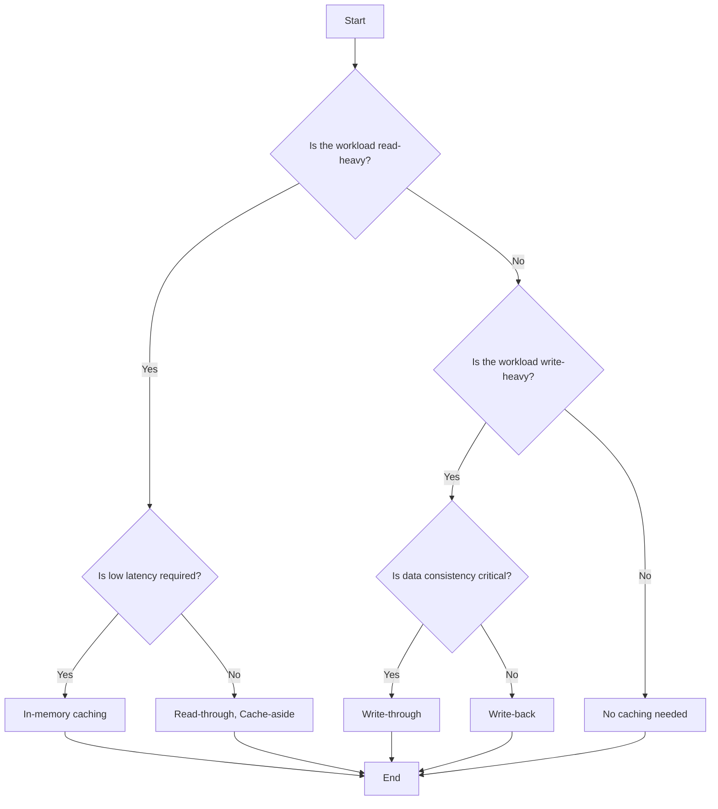

```mermaid
graph TD
A[Start] --> B{Is the workload read-heavy?}
B -->|Yes| C{Is low latency required?}
C -->|Yes| D[In-memory caching]
C -->|No| E[Read-through, Cache-aside]
B -->|No| F{Is the workload write-heavy?}
F -->|Yes| G{Is data consistency critical?}
G -->|Yes| H[Write-through]
G -->|No| I[Write-back]
F -->|No| J[No caching needed]
D --> K[End]
E --> K
H --> K
I --> K
J --> K
```
