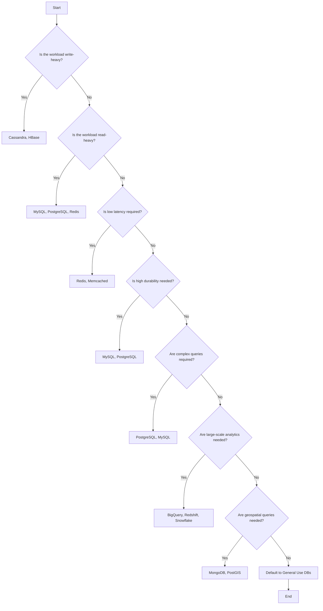

```mermaid
graph TD
    A[Start] --> B{Is the workload write-heavy?}
    B -->|Yes| C[Cassandra, HBase]
    B -->|No| D{Is the workload read-heavy?}
    D -->|Yes| E[MySQL, PostgreSQL, Redis]
    D -->|No| F{Is low latency required?}
    F -->|Yes| G[Redis, Memcached]
    F -->|No| H{Is high durability needed?}
    H -->|Yes| I[MySQL, PostgreSQL]
    H -->|No| J{Are complex queries required?}
    J -->|Yes| K[PostgreSQL, MySQL]
    J -->|No| L{Are large-scale analytics needed?}
    L -->|Yes| M[BigQuery, Redshift, Snowflake]
    L -->|No| N{Are geospatial queries needed?}
    N -->|Yes| O[MongoDB, PostGIS]
    N -->|No| P[Default to General Use DBs]
    P --> Q[End]
```
