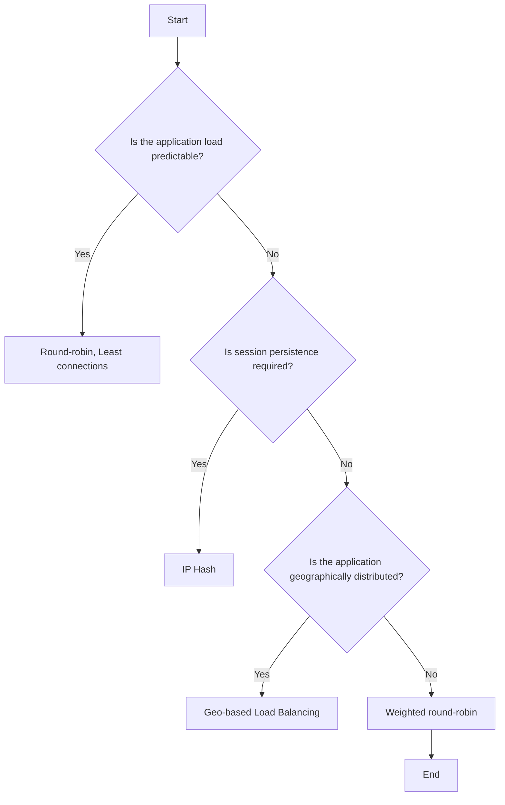

```mermaid
graph TD
A[Start] --> B{Is the application load predictable?}
B -->|Yes| C[Round-robin, Least connections]
B -->|No| D{Is session persistence required?}
D -->|Yes| E[IP Hash]
D -->|No| F{Is the application geographically distributed?}
F -->|Yes| G[Geo-based Load Balancing]
F -->|No| H[Weighted round-robin]
H --> I[End]
```
